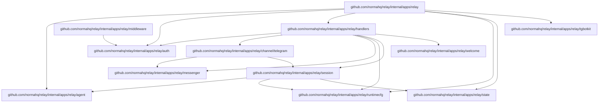

# Norma Relay (V1)

`relay start` is a channel-aware background ACP service that currently binds Telegram chats/topics to ADK agents created by Norma's agent factory.

## Summary

- Runtime stack: `tgbotkit/runtime` + Google ADK runners.
- Telegram is the first supported relay channel; future channels should be added as top-level config siblings such as `relay.whatsapp`.
- Main agent: relay app key `relay.provider` (profile overrides via `profiles.<profile>.relay.provider`).
- Subagents: one session per Telegram topic (`message_thread_id`) with dedicated git worktree.
- Relay startup prompt includes workspace settings for each session; in git workspace mode it also includes session/base/current-branch context and workspace MCP guidance.
- Output streaming:
  - Thought updates: Telegram Bot API `sendMessageDraft` (plain text).
  - Final assistant response: Telegram Bot API `sendMessage` (MarkdownV2; retry without `parse_mode` on failure).
- Auth model: one-time owner authorization with startup-generated token.

## Package Dependencies



### Dependency Summary

| Package | Import Path | Description | Depends On |
|---------|-------------|-------------|------------|
| `relay` | `internal/apps/relay` | Root application module | agent, auth, handlers, runtimecfg, state, tgbotkit |
| `agent` | `internal/apps/relay/agent` | Agent builder & workspace manager | `internal/git`, `pkg/runtime/*` |
| `auth` | `internal/apps/relay/auth` | Owner authentication store | state (interface) |
| `channel/telegram` | `internal/apps/relay/channel/telegram` | Telegram message adapter | messenger, session |
| `handlers` | `internal/apps/relay/handlers` | Telegram command handlers | auth, channel/telegram, messenger, runtimecfg, session, welcome |
| `messenger` | `internal/apps/relay/messenger` | Telegram message sending | `tgbotkit/client` |
| `middleware` | `internal/apps/relay/middleware` | Auth middleware | auth |
| `runtimecfg` | `internal/apps/relay/runtimecfg` | Runtime config loader | `pkg/runtime/appconfig` |
| `session` | `internal/apps/relay/session` | Session management | agent, runtimecfg, state |
| `state` | `internal/apps/relay/state` | SQLite state persistence | `modernc.org/sqlite`, `updatepoller` |
| `tgbotkit` | `internal/apps/relay/tgbotkit` | Telegram bot runtime | `tgbotkit/*` |
| `welcome` | `internal/apps/relay/welcome` | Welcome message builder | (standalone) |

## Startup Order (Required)

Relay startup order is strict:

1. Load Norma + relay config.
2. Start internal MCP lifecycle manager.
3. Start relay root provider via `agentfactory.Factory`.
4. Start Telegram runtime receiver.

Internal MCP v1 scope is config + lifecycle plumbing; server implementations can be added incrementally.

## Configuration

Relay config is loaded from one selected file (priority order):

1. Embedded defaults (`cmd/relay/relay.yaml`)
2. Runtime config in `.config/relay/config.yaml`
3. Profile app overrides in the same file (`profiles.<name>.relay.*`)
4. Environment variables (`RELAY_*`) via Viper env mapping

Relay also auto-loads a `.env` file at startup (via `godotenv`) from the relay process working directory only. Values loaded from `.env` are treated as environment variables, so `RELAY_*` entries override file config the same way as exported shell variables.

Example `.env`:

```dotenv
RELAY_TELEGRAM_TOKEN=123456:ABCDEF
RELAY_TELEGRAM_WEBHOOK_ENABLED=true
RELAY_TELEGRAM_WEBHOOK_URL=https://example.com/telegram/webhook
```

Config shape:

```yaml
runtime:
  providers:
    <provider_id>:
      type: <provider_type>
  mcp_servers: {}
relay:
  provider: <provider_id>
  telegram:
    token: ""
profiles:
  <profile>:
    relay:
      provider: <provider_id>
```

### Telegram settings

- `relay.telegram.token`: bot token (required)
  - `relay init` validates token via Telegram API and can store it either in:
    - CWD `.env` as `RELAY_TELEGRAM_TOKEN` (default)
    - relay config file key `relay.telegram.token`
  - when `.env` storage is selected, existing `.env` content is preserved and `RELAY_TELEGRAM_TOKEN` is upserted
- `relay.telegram.webhook.enabled`: enable local HTTP webhook endpoint (`true` => webhook mode, `false` => polling mode; default: `false`)
- `relay.telegram.webhook.url`: outgoing Telegram webhook URL (required when `relay.telegram.webhook.enabled=true`)
- `relay.telegram.webhook.auth_token`: optional webhook auth token
- `relay.telegram.webhook.listen_addr`: local webhook listen address (default: `0.0.0.0:8080`)
- `relay.telegram.webhook.path`: local webhook path (default: `/telegram/webhook`)

### Relay settings

- `relay.working_dir`: optional relay working directory (defaults to process CWD)
- `relay.state_dir`: relay state directory for persistent relay SQLite state (`relay.db`).
  - Stores owner/app KV, `relay.state` MCP KV, session metadata, and Telegram polling offset.
  - Schema is migration-versioned and auto-applied on startup.
  - Relative paths are resolved from `relay.working_dir`.
  - Default: `.config/relay`
- owner auth token is generated during `relay init`, persisted in `relay.db`, and reused by `relay start`
  - if token is missing in existing state, `relay start` backfills one-time and persists it
  - startup logs expose auth link via `auth_url` field
- bundled relay MCP listener always binds to local ephemeral address (`127.0.0.1:0`)
  - bundled routes on this listener:
    - `/mcp` and `/mcp/relay` for the built-in relay MCP server
- Relay config is edited via the config file itself, not through MCP.
  - relay agents should use the config path shown in the system instruction and edit `.config/relay/config.yaml` directly
- `relay.mcp_servers`: extra MCP server IDs for all relay-started sessions (must reference IDs declared in `runtime.mcp_servers`)
  - effective MCP IDs = bundled defaults + `runtime.providers.<provider_id>.mcp_servers` + `relay.mcp_servers` (deduplicated)
- `relay.system_instructions`: optional relay instruction text applied to all sessions
  - value: instruction text appended in relay prompt for all agents
  - effective relay instruction order: built-in relay instructions + `runtime.providers.<provider_id>.system_instructions` + `relay.system_instructions` (last wins by position)
  - `relay init` generates a channel-aware example prompt
- `relay.workspace.mode`: `on|off|auto` (default `auto`)
  - `on`: always use Git worktrees per session; startup fails if `working_dir` is not a Git repository
  - `off`: run agents directly in relay `working_dir` (no `relay.workspace` namespace)
  - `auto`: enable worktrees only when `working_dir` is a Git repo, otherwise fallback to `off`
- `relay.workspace.base_branch`: base branch used for workspace sync/export (for example `main`, `master`, `develop`)
  - `relay init` detects current HEAD branch and writes it when available
  - if empty, relay resolves base branch from current HEAD at startup
  - `relay.workspace.export` requires main repo to be on this branch
- Relay is Beads-independent by default and does not auto-start bundled `norma.tasks` MCP.

## Session Model

Session key:

- Root relay session: `(chat_id, topic_id=0)`
- Topic subagent session: `(chat_id, topic_id)`
- Canonical relay session IDs are channel-scoped. Telegram uses `tg-<chat_id>-<topic_id>`.
- Root sessions are created lazily on the first owner message in that chat (`topic_id=0`).

Session runtimes are still in-memory, but metadata is persisted in `relay.db`.
Relay lazy-restores a topic session on first message after restart when metadata exists.

## Message Flow

1. User sends Telegram message.
   - In non-DM chats (groups/supergroups/topics), relay processes a message only when it starts with `@<bot_username>` or is a reply to this bot's message.
   - In DM chats, relay processes non-command text messages normally.
2. Relay resolves session by `(chat_id, topic_id)`.
3. If topic session is missing in memory, relay attempts lazy restore from persisted metadata.
4. Relay calls ADK runner for that session.
5. Relay streams partial updates to Telegram using Bot API `sendMessageDraft`.

## Telegram Messaging Behavior

Per model turn:

1. Thought events are emitted as plain `sendMessageDraft` updates using a stable `draft_id`; relay also sends `sendChatAction` with `typing` for the same chat/topic.
2. Final assistant text is sent with `sendMessage` using MarkdownV2.
3. If MarkdownV2 delivery fails, relay retries once without `parse_mode`.

## Topic Sessions

Relay runs with a single provider per process (`relay.provider`).

- The provider is initialized before message handling.
- The root relay session (`topic_id=0`) is bootstrapped for the owner chat during activation.
- Every chat/topic pair maps to its own ADK session, but all sessions in that relay instance use the same provider runtime.

### Manual session control

- `/topic <name>` (DM only, owner/collaborator): creates a new Telegram topic and a topic-bound session.
  - `<name>` is required.
  - `<name>` is a session label, not a provider selector.
- `/close` (DM only, owner/collaborator): closes current topic session, or stops root session in main chat (`topic_id=0`).
- `/cancel` (owner/collaborator): cancels active turn and drops queued turns for current session.

### Topic restore/create behavior

- Relay restores persisted topic metadata on first message after restart.
- Persisted session label is reused as-is for restore; if missing, relay falls back to label `auto`.
- If no persisted topic metadata exists, relay creates a new topic session using label `auto`.
- Welcome message uses compact KV format:
  - `name=<label> session=<session_id> type=<provider_type> model=<model> mcp=<server1,server2>`

## Workspace MCP Usage

- `relay.workspace.import`
  - rebases the session workspace onto the configured base branch
  - works for active or persisted sessions as long as workspace metadata exists in `relay.db`
- `relay.workspace.export`
  - squash-merges the session workspace branch into the configured base branch with the provided Conventional Commit message
  - also works for persisted sessions before lazy restore

## Acceptance/Verification Scenarios

1. Startup order enforces internal MCP -> root provider -> bot runtime.
2. Polling mode starts by default when `relay.telegram.webhook.enabled=false`.
3. Webhook mode (`relay.telegram.webhook.enabled=true`) fails fast without `relay.telegram.webhook.url`.
4. `/start <token>` registers owner once; non-owner traffic is rejected.
5. `/topic <name>` creates topic + relay session and persists session metadata.
6. `/topic` without name returns usage error.
7. Restart clears in-memory sessions but topic sessions are lazy-restored from persisted metadata.
8. Polling mode resumes from persisted Telegram offset in relay state DB.
9. Partial thought updates are sent with Telegram Bot API `sendMessageDraft`.
10. Final assistant response is sent with `sendMessage` using MarkdownV2 with fallback retry without `parse_mode`.
11. `/close` in a topic closes that topic and stops the session; `/close` in root chat stops only root session.
